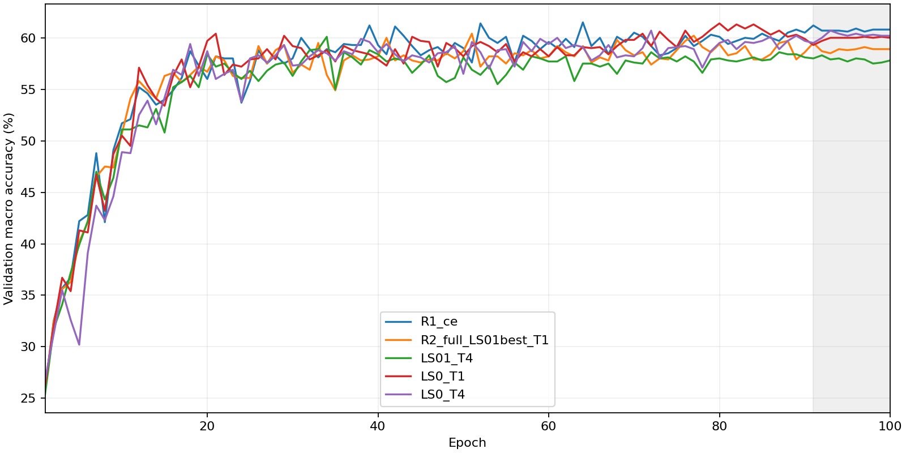

# Stage 1 — KD gate

Decision: **STOP_SEED0**

Only validation is used for student decisions. NOT_RUN means no measurement; it is not a failure or a pass.

R2 uses newly trained seed 0 T_LS01 best.pt. The historical 58.91 ±2.0 pp reference is retained by user instruction; the original experiment-2 teacher is not replayed.

## Table 1: teacher outputs

Train uses augmentation once with measurement seed 0; KL gates apply only to train. Entropy is normalized by log(9).

| seed | teacher | split | accuracy % | macro % | KL to LS (nats) | nontarget entropy T=1 | T=4 | train gate |
|---|---|---|---|---|---|---|---|---|
| 0 | T_LS0 | train | 100.0000 | 100.0000 | 0.092566 | 0.963456 | 0.997683 | PASS |
| 0 | T_LS0 | val | 98.0000 | 98.0000 | 0.179356 | 0.908407 | 0.990198 | report only |
| 0 | T_LS01 | train | 100.0000 | 100.0000 | 0.000582 | 0.998353 | 0.999898 | PASS |
| 0 | T_LS01 | val | 98.5000 | 98.5000 | 0.056892 | 0.979897 | 0.998909 | report only |
| 0 | T_LS01_best | train | 100.0000 | 100.0000 | 0.000656 | 0.998168 | 0.999886 | N/A |
| 0 | T_LS01_best | val | 98.6000 | 98.6000 | 0.058031 | 0.979610 | 0.998886 | report only |
| 1 | T_LS0 | train | — | — | — | — | — | NOT_RUN |
| 1 | T_LS0 | val | — | — | — | — | — | NOT_RUN |

## Table 2: students

Means use epochs 91–100; differences use unrounded values.

| seed | run | val macro mean % | Δ CE (pp) | Δ regression reference (pp) | initial checksum |
|---|---|---|---|---|---|
| 0 | R1_ce | 60.7800 | +0.0000 | +0.0000 | PASS |
| 0 | R2_full_LS01best_T1 | 58.9100 | -1.8700 | +0.0000 | PASS |
| 0 | LS01_T4 | 57.8700 | -2.9100 | 미사용 | PASS |
| 0 | LS0_T1 | 59.9200 | -0.8600 | 미사용 | PASS |
| 0 | LS0_T4 | 60.2100 | -0.5700 | 미사용 | PASS |
| 1 | R1_ce | — | — | — | NOT_RUN |
| 1 | LS0_T4 | — | — | — | NOT_RUN |

## Table 3: decisions

| rule | status |
|---|---|
| local/server test suite (current source) | PASS |
| R1_ce: regression ±2.0 pp | PASS |
| R1_ce: initial checksum | PASS |
| R2_full_LS01best_T1: regression ±2.0 pp | PASS |
| R2_full_LS01best_T1: initial checksum | PASS |
| seed 0 KD − CE ≥1.5 pp | FAIL |
| seed 0 T_LS0: train KL gate | PASS |
| seed 0 T_LS01: train KL gate | PASS |
| seed 1 T_LS0: train KL gate | NOT_RUN |
| manifest_sha256 | PASS |
| Seed 0 gate failed; ask user for next step | FAIL |

Selected seed 0 candidate: `LS0_T4`.

해석: 위 결정은 사전 고정된 임계값만 적용한 결과이며, 미실행 항목의 성능은 추정하지 않는다.
